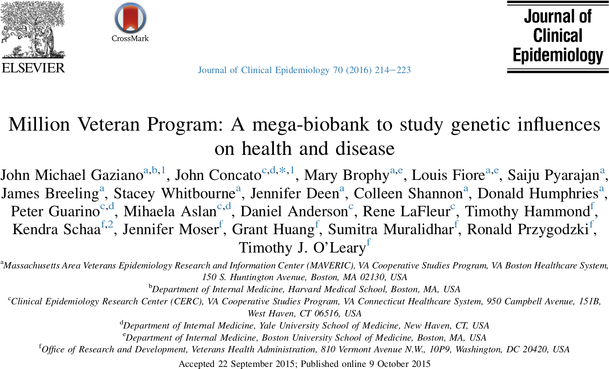
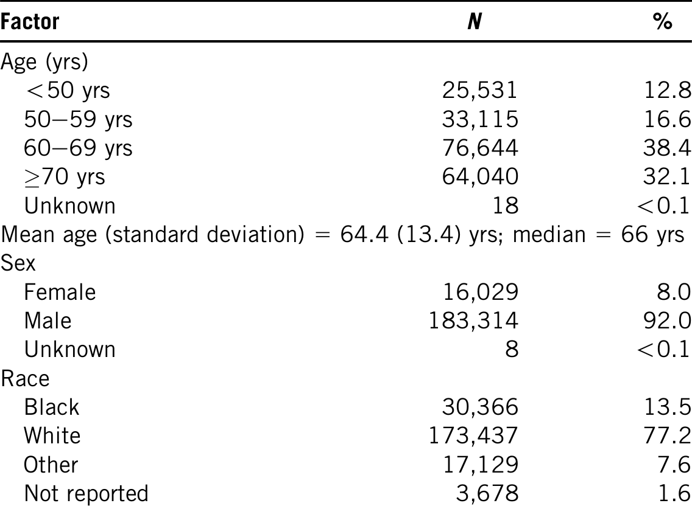

# presentation_million_veterans_program_20211111

Presentation of the Million Veteran Program on 2021-11-11

Start: [Gaziano et al., 2016]

First study: [Nguyen et al., 2018]

# Data

 * Informatics infrastructure:: GenISIS
 * Medical record and questionnaire data
 * Peripheral blood: plasma, buffy coat, and DNA
 * For all participants: 723K markers from Affymetrix Axiom Biobank Array
    1. Enriched for exome SNPs
    2. Has tag SNPs validated for diseases, including psychiatric traits;
    3. Has been augmented with biomarkers of specific interest to
       the VA population including enrichment for African American and Hispanic 
       ancestry markers, as well as validated markers for common diseases (such as hypertension, prostate
       cancer, and breast cancer
 * 28k participants: whole-exome sequencing (approximately
 * 2k participants: whole genome sequencing

## Access to data

Access to MVP data and/or samples is governed by the scope of MVP 
informed consent and VA policies, and requires scientific review by 
appropriate VA review committees.
At this time, [...] Without Compensation (university-
affiliated) investigators are eligible to use MVP data [...].
The current access process includes several elements:
  1. potential users can request, obtain permission, and search
     metadata (with or without technical assistance) to perform
     initial queries and other project-building activities. 
  2. After a study population is defined, the researcher can
     request approval to receive detailed data, as a specific data
     mart that provides limited access (only to their study group
     and only for the identified subset of data) for proposal devel-
     opment. 
  3. Following approval of the proposal
     through peer-review, each study-specific data mart is then
     connected to the analysis environment with a high-
     performance computer cluster and a standard set of bioinfor-
     matics tools. 
  4. After the analysis is complete, the
     researcher is expected to retain key findings in GenISIS, with
     data and analysis routines to be made searchable by future re-
     searchers (in subsequent studies), and with corresponding
     publications also uploaded. 

## Misc

 * Setting up infrastructre: $30 million (2010-2015)
 * Completed and pending genomic analyses: $55 million (2010-2015)

Abbreviation|Full
------------|-----------------------
MVP         |Million Veteran Program
VA          |Veterans Affairs

## References

 * [Gaziano et al., 2016] Gaziano, John Michael, et al. "Million Veteran Program: A mega-biobank to study genetic influences on health and disease." Journal of clinical epidemiology 70 (2016): 214-223.

 * [Nguyen et al., 2018] Nguyen, Xuan-Mai T., et al. "Baseline characterization and annual trends of body mass index for a mega-biobank cohort of US Veterans 2011–2017." Journal of health research and reviews in developing countries 5.2 (2018): 98.

# Present the following

From Weronica

 * What data is available
   * Research profile (metabolics, genetics, cancer, cardiovascular etc)
     * Registry, follow up, longitudinal, prospective?
   * Raw data?
   * Summary statistics?
   * Health variables?
   * Genetics?
     * What kind?
   * diseases?
 * Number of participants
 * How to apply, who can get access?
 * Could it be of relevance to our research group?
   * New projects, replicating old findings, meta-analysis etc
 * Costs
 * (Specific details, ethics, rules, responsibilities to report results, involvement in research, etc)

